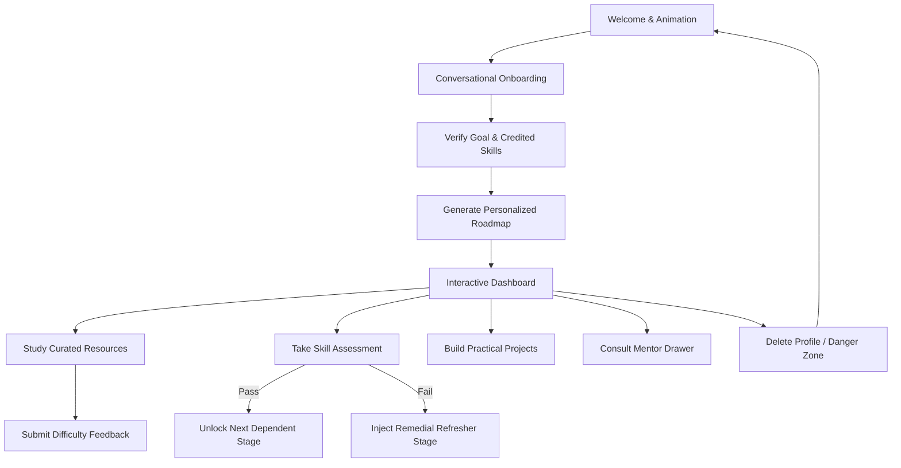
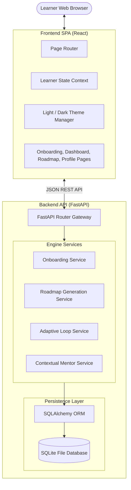
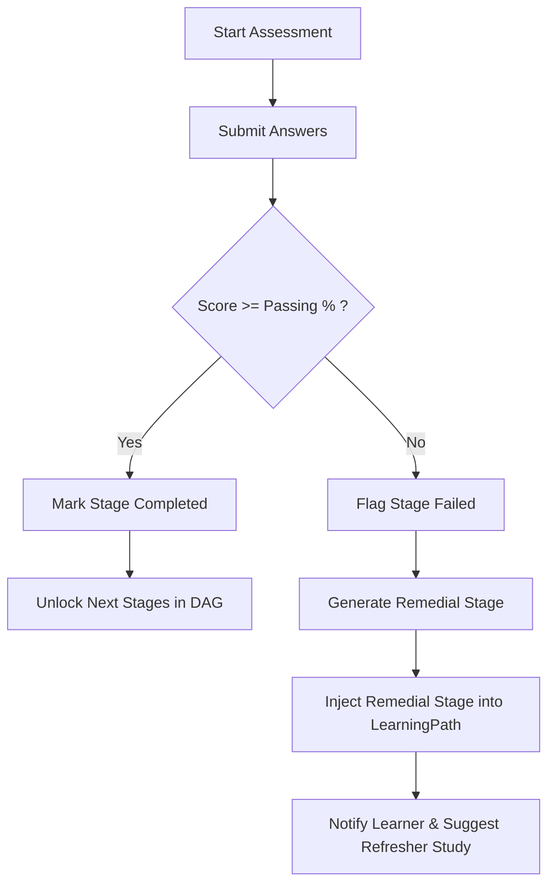

# LearnPath: Personalized Learning Workspace
## Technical Solution & Implementation Documentation

---

## 1. Title Page
* **Product Name**: LearnPath
* **Version**: 1.0.0
* **Subtitle**: A Personalized Learning Workspace with Context-Aware Mentorship and Dynamic Path Adaptation
* **Target OS**: Cross-Platform (Windows/macOS/Linux)
* **Date**: August 2026

---

## 2. Project Overview
LearnPath is an interactive learning platform designed to replace generic, linear, one-size-fits-all online courses with personalized, adaptive learning paths. By analyzing a learner's goals, prior experiences, and current skill set through conversational onboarding, LearnPath constructs a tailored educational roadmap. As the learner progresses, the system continually evaluates their understanding via quizzes and feedback loops, dynamically inserting remedial content or fast-tracking topics to guarantee an optimal learning velocity.

---

## 3. Problem Statement
Traditional online learning suffers from two major pain points:
1. **Inefficient Progression**: Learners are forced to sit through concepts they already know (lack of crediting) or are blocked by advanced materials for which they lack prerequisites.
2. **Static Curriculum**: When a learner struggles with a difficult concept, static courses fail to offer personalized remedial materials, leading to frustration and high drop-out rates.

---

## 4. Problem Understanding
Personalized educational navigation requires modeling:
* **The Knowledge Domain**: Mapping skills as a Directed Acyclic Graph (DAG) with strict prerequisite dependencies.
* **The Learner Profile**: Storing goals, background, level, timeline, and daily commitment constraints.
* **The Progression State**: Tracking real-time resource completions, assessment history, and project deliverables.
* **The Adaptation Loop**: Listening to learner feedback and assessment failures to reorganize future roadmap nodes.

---

## 5. Proposed Solution
LearnPath implements a hybrid system combining:
1. **Conversational Onboarding**: A natural, state-aware dialog system that determines the user's target domain and credits prior skills.
2. **Prerequisite-Aware Path Builder**: A topological sorting algorithm that structures learning stages based on skill dependencies.
3. **Dynamic Path Adaptation**: An event-driven correction engine that inserts refreshers or unlocks skipping milestones.
4. **Context-Aware Mentorship**: An integrated Mentor panel that references the learner's current stage and goals to provide contextual code reviews, explanations, or scheduling advice.

---

## 6. Objectives
* **Zero Orphan Data**: Ensure 100% database consistency with robust cascading deletions.
* **100% Availability**: Implement a deterministic local fallback engine allowing the platform to run entirely offline or without an active AI API key.
* **Responsive Visual Excellence**: Create an elegant, professional user interface with high-contrast Light/Dark mode transitions.

---

## 7. Key Features
* **Stateful Conversational Onboarding**: Gathers background, experience level, and timeline context cleanly.
* **Dynamic Roadmaps**: Chronological learning stages with clear statuses (completed, in-progress, available, locked).
* **Remedial Path Injections**: Automatic addition of refresher material upon failing topic assessments.
* **Practical Project Workspace**: Hands-on milestones mapped to target skill prerequisites.
* **Danger Zone Data Deletion**: Full cascading cleanup of learner profiles, paths, messages, and progress records.

---

## 8. User Journey
1. **First-Run Landing**: Learner starts with a clean startup animation and is introduced to the platform.
2. **Onboarding Conversations**: Converses with the Mentor to declare goals (e.g., UI/UX Design, Cloud/DevOps) and credit existing knowledge (e.g., HTML/CSS).
3. **Roadmap Generation**: Generates their customized workspace.
4. **Active Study**: Completes resources, submits difficulty ratings, and takes topic assessments.
5. **Real-time Adaptation**: If an assessment is failed, a remedial refresher stage is automatically inserted.
6. **Workspace Cleanup**: The learner can reset the database or permanently delete their profile to start fresh.

---

## 9. System Architecture
LearnPath utilizes a decoupled full-stack architecture:
* **Frontend**: SPA built using React 19 and Vite 8, featuring local storage persistence for themes and onboarding drafts.
* **Backend**: FastAPI REST API providing endpoints for onboarding, path calculation, assessments, and profile management.
* **Database**: SQLite database accessed via SQLAlchemy ORM, enforcing cascade delete-orphan constraints.

---

## 10. Application Workflow
* **Onboarding Chat**: User message -> Router -> Onboarding Service -> Check/Create Draft Learner in DB -> Save Messages -> Deterministic State Machine -> Return response with updated profile.
* **Roadmap Build**: Create profile -> Clear old paths -> Sort skills topologically -> Build stages -> Create database paths.

---

## 11. Learner Profiling
The learner profile comprises:
* **`direction`**: Core domain track (UI/UX Design, Cloud/DevOps, AI/ML, Data Engineering, Full-Stack Web).
* **`current_knowledge`**: Prior credited skills list.
* **`current_level`**: Calibrated starting tier (Beginner, Early Intermediate, Intermediate, Advanced).
* **`available_time`**: Constrains stage progression times (e.g. 1 hour daily).

---

## 12. Recommendation Approach
LearnPath recommendations are built around **Prerequisite Sufficiency**. A learning resource is recommended only if the learner has completed all prerequisite skills for that resource's skill node.

---

## 13. Prerequisite/Dependency Logic
Prerequisites are modeled as a Directed Acyclic Graph (DAG):
1. **Node Selection**: Identify all skills in the selected `direction`.
2. **Prerequisite Resolution**: Retrieve prerequisite relations from `skill_prerequisites`.
3. **Topological Sort**: Order skills such that for every directed edge U -> V, skill U (prerequisite) is ordered before skill V.
4. **Skipping Logic**: Skills marked as `current_knowledge` are skipped during stage building, fast-tracking the user.

---

## 14. Personalized Learning Path Generation
1. Resolve sorted skills list (excluding credited skills).
2. For each sorted skill, retrieve the corresponding `LearningResource` list.
3. Build a `LearningPathItem` (stage) for each skill containing description, resource links, assessment details, and customized "why recommended" copy based on the learner's goal.

---

## 15. Adaptive Learning
LearnPath adjusts the roadmap dynamically based on learner feedback:
* **Difficulty Feedback**: If a learner marks a stage as "difficult" or "very difficult", the system flags the skill node and offers additional reading resources.
* **Assessment Failure**: Failing a quiz with a score below the passing threshold triggers an **Adaptive Remedial Action**. A remedial stage is immediately injected directly preceding the current stage, populated with fundamental subconcept tutorials.

---

## 16. Assessments
Topic assessments consist of multiple-choice questions:
* Enforces a passing percentage (typically 70%).
* Stores attempt history under `LearnerAssessmentAttempt`.
* Tracks weak areas dynamically in the profile to customize future Mentor review advice.

---

## 17. Progress Tracking
Progress is calculated by evaluating actual completed nodes:
Progress % = (Completed Stage Items / Total Stage Items) * 100
Progress is computed in real-time on the database to ensure no stale cached counters.

---

## 18. Mentor
The **Mentor** is a context-aware sidebar dialog:
* Retrieves conversation logs from `MentorMessage`.
* Combines the active roadmap stage, current weak areas, and user query into a structured system context.
* Returns tailored replies, sample code, and suggested follow-up chips.

---

## 19. Database Design
LearnPath uses a structured relational SQL database:
* **`learners`**: Stores profile information and notes (contains serialized onboarding states).
* **`skills` & `skill_prerequisites`**: Represents the domains and prerequisite relationships.
* **`learning_paths` & `learning_path_items`**: Mapped roadmap elements.
* **`learner_progress`**: Completed resource logs.
* **`learner_assessment_attempts`**: Quiz history records.
* **`mentor_messages`**: Dialogue history logs.
* **`learner_feedback`**: Ratings and comments.
* **`learner_milestones`**: Achievement locks.

---

## 20. Technology Stack
* **Language**: Python 3.13 (Backend), JavaScript ES6 (Frontend)
* **API Framework**: FastAPI (Uvicorn server)
* **ORM**: SQLAlchemy
* **Database Engine**: SQLite
* **Frontend Library**: React 19
* **Build System**: Vite 8
* **Icons**: Inline SVGs

---

## 21. Frontend Architecture
* **`context/LearnerContext.jsx`**: Manages global variables, active profile loads, and dashboard statistics.
* **`pages/OnboardingPage.jsx`**: Layout for conversational onboarding, featuring inputs, chips, and localStorage session backups.
* **`pages/ProfilePage.jsx`**: Standard calibration controls, Appearance Settings (Light/Dark toggles), and Danger Zone.

---

## 22. Backend Architecture
* **`routers/profile.py`**: Handles creation, updates, and DELETE cascades.
* **`routers/onboarding.py`**: Chat gateway routing to service layer.
* **`services/onboarding_service.py`**: Local NLP and state machine processor.
* **`services/recommendation_service.py`**: Topological sort path compiler.

---

## 23. API Overview
* `POST /api/onboarding/chat`: Conversational onboarding turn.
* `POST /api/profile`: Creates profile and generates path.
* `PUT /api/profile/{id}`: Updates profile / recalculates path.
* `DELETE /api/profile/{id}`: Cascades delete for learner records.
* `GET /api/paths/{learner_id}`: Fetches active roadmap.
* `POST /api/assessments/{id}/submit`: Submits quiz attempts.
* `POST /api/profile/reset`: Clears all learner records for demo.

---

## 24. Data Flow
1. User types message -> Frontend React.
2. REST API call -> FastAPI router.
3. Service processes transaction -> Modifies SQLAlchemy objects.
4. Database commits changes -> SQLite database writes records.
5. Return JSON payload -> React updates local contexts.

---

## 25. Security/Validation Considerations
* **SQL Injection Prevention**: Enforced via SQLAlchemy parameter binding.
* **Strict Schema Validation**: Implemented using Pydantic models for request bodies.
* **Input Sanitization**: Escape characters stripped from user onboarding chat messages.

---

## 26. Testing and Verification
LearnPath features automated tests:
* Run command: `python -m pytest tests -v`
* Asserts state machine responses, adaptive fallback flows, resetting logic, and topological sort validations.

---

## 27. Challenges Faced
* **Onboarding State Loops**: Early models repeatedly asked the same questions. Resolved by introducing explicit state values inside the learner record.
* **Cascading Orphans**: Deleting a profile initially left orphan roadmap items. Resolved by adding `cascade="all, delete-orphan"` relationships.

---

## 28. Solutions to Challenges
* **Database State Restoration**: Backing up the active onboarding learner ID in `localStorage` allows a page refresh to seamlessly reload progress.
* **Theme Switching Flicks**: A script injected directly in `index.html`'s `<head>` parses the theme from `localStorage` before the page paints.

---

## 29. Results
* All 12 automated unit tests pass with zero failures.
* Complete database cascading cleanup works flawlessly without leaving orphans.
* Startup loading animations execute correctly under both Light and Dark themes.

---

## 30. Limitations
* **Local Persistence**: SQLite is ideal for a single-user local demo but requires transitioning to PostgreSQL for multi-tenant concurrent deployments.
* **Conversational Parsing**: Deterministic local NLP covers core domains but is enhanced when a robust Gemini API key is configured.

---

## 31. Future Improvements
* **Interactive Code Labs**: Direct terminal execution of code steps.
* **Visual Progress Graphs**: Node diagrams representing prerequisite DAG progress dynamically.
* **Multi-user Authentication**: Full login flow with encrypted password security layers.

---

## 32. Conclusion
LearnPath is a robust, responsive, and highly personalized learning platform. By mapping skill prerequisites as a Directed Acyclic Graph, validating achievements via assessments, adapting path structures on the fly, and providing context-aware Mentor conversations, it offers a professional and premium learning experience.
