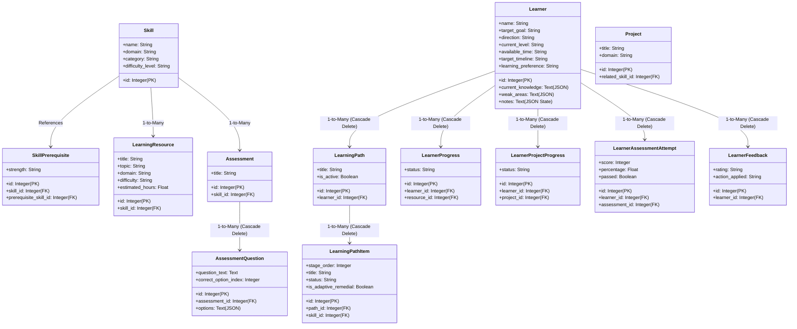

# LearnPath: Project Source of Truth

This document serves as the absolute technical source of truth for the **LearnPath** application. Every detail in this document is extracted directly from the actual codebase.

---

## 1. Project Structure

The actual directory layout of the repository is structured as follows:

```
LearnPath/
├── backend/
│   ├── app/
│   │   ├── routers/            # API Router endpoints
│   │   │   ├── assessments.py
│   │   │   ├── dashboard.py
│   │   │   ├── feedback.py
│   │   │   ├── mentor.py
│   │   │   ├── onboarding.py
│   │   │   ├── paths.py
│   │   │   ├── profile.py
│   │   │   ├── projects.py
│   │   │   └── resources.py
│   │   ├── services/           # Core logic & algorithms
│   │   │   ├── adaptive_service.py
│   │   │   ├── mentor_service.py
│   │   │   ├── onboarding_service.py
│   │   │   ├── progress_service.py
│   │   │   └── recommendation_service.py
│   │   ├── config.py           # Environment and app configuration
│   │   ├── database.py         # SQLAlchemy engine and session setup
│   │   ├── main.py             # FastAPI entry point & lifespan hooks
│   │   ├── models.py           # SQLAlchemy declarative database models
│   │   ├── schemas.py          # Pydantic validation schemas
│   │   └── seed_data.py        # Static reference data (skills, questions, etc.)
│   ├── tests/                  # Pytest unit and integration test suite
│   │   ├── test_adaptive.py
│   │   ├── test_api.py
│   │   ├── test_onboarding_cases.py
│   │   └── test_recommendation.py
│   ├── learnpath.db            # SQLite database file
│   └── requirements.txt
├── docs/
│   ├── LearnPath_Solution_Documentation.md
│   ├── PROJECT_SOURCE_OF_TRUTH.md
│   └── testing.md
├── frontend/
│   ├── src/
│   │   ├── api/
│   │   │   └── client.js       # Axios client for API communications
│   │   ├── components/         # Reusable UI parts
│   │   │   ├── AIMentorDrawer.jsx
│   │   │   ├── FeedbackModal.jsx
│   │   │   ├── Header.jsx
│   │   │   ├── Icons.jsx
│   │   │   ├── MarkdownRenderer.jsx
│   │   │   ├── Navbar.jsx
│   │   │   └── Sidebar.jsx
│   │   ├── context/
│   │   │   └── LearnerContext.jsx # Global React context state provider
│   │   ├── pages/              # Main view screens
│   │   │   ├── AssessmentPage.jsx
│   │   │   ├── DashboardPage.jsx
│   │   │   ├── LearningPathPage.jsx
│   │   │   ├── OnboardingPage.jsx
│   │   │   ├── ProfilePage.jsx
│   │   │   ├── ProjectsPage.jsx
│   │   │   └── ResourcesPage.jsx
│   │   ├── App.css
│   │   ├── App.jsx             # Shell provider, loading overlay, router
│   │   ├── index.css           # Styling, themes, responsive layout
│   │   └── main.jsx
│   ├── index.html
│   ├── package.json
│   └── vite.config.js
└── README.md
```

---

## 2. Technology Stack

### Frontend
- **React.js (v18.x)**: Component architecture and reactive state management.
- **Vite**: Ultra-fast build tool and local dev server.
- **Vanilla CSS**: Clean, custom styling with CSS variable themes, fluid grids, and transitions.
- **Axios**: Standard HTTP client mapped in [client.js](frontend/src/api/client.js) to consume backend routes.

### Backend
- **FastAPI**: Modern, high-performance web framework.
- **Uvicorn**: ASGI web server running the app on port 8000.
- **Pydantic**: JSON request validation and response serialization.

### Database
- **SQLite**: Local disk-based relational database.
- **SQLAlchemy (ORM)**: Declarative model mapping, querying, and relational cascades.

### AI / ML & Integrations
- **Google Gemini API (via HTTP)**: Orchestrated inside [mentor_service.py](backend/app/services/mentor_service.py) using the configurable model (defaults to `gemini-1.5-flash`).
- **Deterministic Keyword Matcher & State Machine**: Local NLP fallback.

---

## 3. Frontend Architecture

### State Management & Context
- [LearnerContext.jsx](frontend/src/context/LearnerContext.jsx): Declares and exports the state variables for the active learner session, dashboard data, roadmap items, current resources, and assessments.
- Persistence is synchronized with the backend SQLite database (established as the single source of truth). Local storage is reserved only for UI preferences (`learnpath_theme` and `learnpath_sidebar_collapsed`).

### Pages and Routing
Rather than heavy client routers, the shell [App.jsx](frontend/src/App.jsx) routes pages via a simple state toggle (`activePage`), ensuring fast transitions:
1. **Onboarding**: State-aware chat UI.
2. **Dashboard**: Greeting, full-width Continue Learning banner, overall progress tracking, skill level metrics, and recent activities.
3. **Roadmap**: Chronological, interactive tree timeline displaying stage cards (Locked, Available, In Progress, Completed) and adaptive flags.
4. **Resources**: Curated list of links and tutorials.
5. **Projects**: Practical mini-project sheets with objectives.
6. **Assessments**: Interactive multiple-choice quizzes with scoring.
7. **Profile**: Summarized details, editable input fields, and a permanent deletion danger zone.

---

## 4. Database Schema Mapping

The database schema is declared in [models.py](backend/app/models.py). The tables and relationships are defined as follows:



---

## 5. System Knowledge vs. Learner Data

To maintain clean architecture, LearnPath enforces a strict partition between read-only reference data and mutable learner data.

### System / Reference Data (Preserved on reset/deletion)
- `skills`: Master catalog of concepts.
- `skill_prerequisites`: DAG edges defining requirements.
- `learning_resources`: Reading lists, labs, and documentation.
- `projects`: Practice project descriptions.
- `assessments` & `assessment_questions`: Core quiz banks.
- `milestones`: Master catalog of badges and unlock values.

### Learner-Specific Data (Completely wiped on reset/deletion)
- `learners`: Individual profiles and preferences.
- `learning_paths` & `learning_path_items`: Personalized sequences.
- `learner_progress`: Checklist ticks on resources.
- `learner_project_progress`: Project checklist ticks.
- `learner_assessment_attempts`: Score archives.
- `learner_feedback`: logged difficulty comments.
- `learner_milestones`: Unlocked milestone records.
- `mentor_messages`: Conversation chat logs.

---

## 6. Onboarding & Profiling Logic

Onboarding is handled by a state-aware conversation engine implemented in [onboarding_service.py](backend/app/services/onboarding_service.py).

### Conversational State Machine (State-Aware)
The system maintains onboarding progress directly inside SQLite. The state is serialized as a JSON string inside the `Learner.notes` field under the `onboarding_state` key. The state machine transitions sequentially:
- **`ask_goal`**: Triggers if no domain keyword matches. Returns lists of target domains as clickable UI chips.
- **`ask_experience`**: Prompts the user to declare Figma, coding, or system command-line experience based on the inferred domain.
- **`ask_study_time`**: Inquires about daily study commitment limits.
- **`ready`**: Marks onboarding completed and presents the "Generate Roadmap" chip.

### Parsing Pipeline
1. **Goal Extraction**: Searches user text for goal phrases using regex matching:
   `"(?:want to (?:become|be|learn)|goal is to|interested in|looking to learn|hoping to become)\s+([^.,;]+)"`.
2. **Prior Skill Extraction**: Fuzzy matches words in user text against a lookup dictionary of 45 common terms (e.g. `k8s` -> `Kubernetes`, `ec2` -> `AWS Core Services`).
3. **Experience Level**: Automatically infers standard level strings (`Beginner`, `Early Intermediate`, `Intermediate`) based on prior skills counts and vocabulary keywords.
4. **Time & Commitment**: Detects hour patterns (e.g., `1-2 hours daily`) via regular expressions.

---

## 7. Recommendation & Prerequisite Resolution

Roadmaps are dynamically compiled using topological sorting inside [recommendation_service.py](backend/app/services/recommendation_service.py).

### Topological Sorting (DAG Traversal)
Prerequisites are represented as directed edges between skills. The service builds a directed acyclic graph (DAG) mapping parent skills to child skills and resolves order using a Depth-First Search (DFS) post-order traversal:

```python
def visit(s_id: int):
    if s_id in visited or s_id not in skill_dict:
        return
    for req_id in prereq_map.get(s_id, []):
        if req_id in skill_dict:
            visit(req_id)
    visited.add(s_id)
    ordered_skills.append(skill_dict[s_id])
```
This guarantees that child stages are strictly locked until all prerequisite parent stages are resolved.

### Transparent Recommendation Scoring
The priority weights for ordering available stages are calculated via:
$$\text{Score} = (\text{Relevance} \times 40) + (\text{Prerequisite Status} \times 30) + (\text{Difficulty Alignment} \times 20) - \text{Feedback Penalty}$$
- **Relevance**: Fixed baseline of `40.0` points for matching domain.
- **Prerequisite Status**: `30.0` points if all prerequisites are satisfied; otherwise `5.0`.
- **Difficulty Alignment**: Evaluated by map distances:
  $$\text{Distance} = |\text{Learner Level} - \text{Skill Difficulty}|$$
  $$\text{Difficulty Score} = \max(5.0,\, 20.0 - (\text{Distance} \times 7.0))$$

---

## 8. Adaptive Learning Logic

Adaptive adjustments are processed inside [adaptive_service.py](backend/app/services/adaptive_service.py).

### Feedback Loop Interventions
- **Difficult Rating**: If a learner logs feedback as `"difficult"` or `"very_difficult"`, the system shifts downstream item orders by `+1` and inserts a custom refresher stage (e.g. `Figma: Guided Practice Lab & Refresher`) at `stage_order + 1`.
- **Fast-Tracking**: If a learner logs feedback as `"already know"` or `"skip"`, the system skips the item, marks its status as `"completed"`, and advances the next eligible item status to `"in_progress"`.

### Assessment Failure Interventions
- If a learner fails a quiz (score below **70%** passing threshold), the system updates the `weak_areas` JSON list on the `Learner` record, shifts downstream items by `+1` order, and inserts a targeted refresher (e.g., `Linux Fundamentals Refresher & Concept Drill`) directly after the active stage to reinforce the concept before allowing the user to advance.

---

## 9. Progress Tracking Formulas

Progress metrics are computed dynamically in [progress_service.py](backend/app/services/progress_service.py).

1. **Overall Journey Percent**:
   $$\text{Progress \%} = \text{round}\left( \frac{\text{Completed Items Count}}{\text{Total Path Items Count}} \times 100 \right)$$
2. **Skill Competency Percent**:
   - **Completed Stage**: `100%` (Mastered)
   - **Prior Declared Skill**: `90%` (Prior Skill)
   - **Currently Active Stage**: `45%` (In Progress)
   - **Lock/Upcoming**: `0%` (Upcoming)

---

## 10. AI Mentor & Intent Fallback

The Mentor system in [mentor_service.py](backend/app/services/mentor_service.py) gathers complete context (learner level, active stage, completed stages, and weak areas) and retrieves the last 10 messages of conversation history in chronological order.

### Gemini API
If `GEMINI_API_KEY` is present, it constructs a turn-by-turn list payload for the Gemini HTTP endpoint, utilizing system instructions to prompt responses in JSON format containing a markdown `reply` and list of `suggested_followups`.

### Local Intent Fallback Classifier
If no API key is set, the local fallback processes user text using keyword matching for 13 distinct intents:
1. **Reasoning (`why`, `recommend`, `sequence`)**: Explains prerequisite sequencing.
2. **Study Plan (`what should i study`, `plan`)**: Generates blocks based on learner availability.
3. **Explanation (`explain`, `what is`)**: Explains concepts in analogical terms.
4. **Struggling (`difficult`, `stuck`)**: Recommends breaking down tasks and logging feedback.
5. **Fast-tracking (`skip`, `already know`)**: Directs the user to mark items as completed.
6. **Time limits (`30 minutes`, `short time`)**: Suggests study blocks for limited schedules.
7. **Progress (`progress`, `completed`)**: Returns completed stages counts and percentage.
8. **Next Step (`what comes after`, `next`)**: Lists subsequent modules on the roadmap.
9. **Resources (`resource`, `reading`)**: Directs to the Resources tab.
10. **Practice Strategy (`practice`, `learn`)**: Recommends recall and active practice.
11. **Project (`build`, `project`)**: Connects lessons to practical projects.
12. **Goal Change (`goal change`, `change goal`)**: Guides the learner to recalculate roads via Profile.
13. **Feedback (`feedback`)**: Explains how logs adapt roadmaps.

---

## 11. API Inventory

| Method | Endpoint | Purpose | Request Body | Response JSON | Database Effect |
| :--- | :--- | :--- | :--- | :--- | :--- |
| **POST** | `/api/profile` | Register learner | `LearnerProfileCreate` | `LearnerProfileResponse` | Inserts Learner & generates LearningPath |
| **GET** | `/api/profile` | List all profiles | None | `List[LearnerProfileResponse]` | None |
| **GET** | `/api/profile/{id}` | Fetch profile | None | `LearnerProfileResponse` | None |
| **PUT** | `/api/profile/{id}` | Update profile | `LearnerProfileUpdate` | `LearnerProfileResponse` | Updates fields (may regenerate path) |
| **DELETE** | `/api/profile/{id}`| Delete profile | None | Success message | Cascade deletes all related learner data |
| **POST** | `/api/profile/reset`| Wipe all profiles | None | Success status | Deletes all records from SQLite learners |
| **POST** | `/api/onboarding/chat`| Process chat turn | Chat turn JSON | Chat response JSON | Inserts user/mentor onboarding chat history |
| **POST** | `/api/mentor` | Ask AI Mentor | Mentor request JSON | Mentor reply JSON | Inserts user/mentor chat messages |
| **GET** | `/api/paths/{id}` | Get active roadmap | None | Path details JSON | None |
| **POST** | `/api/paths/items/{id}/complete`| Complete stage | None | Success status | Marks stage completed (unlocks next) |
| **GET** | `/api/dashboard/{id}`| Fetch analytics | None | Dashboard stats JSON | Updates milestones & returns counts |
| **GET** | `/api/resources` | List resources | None | `List[LearningResource]` | None |
| **GET** | `/api/projects` | List projects | None | `List[Project]` | None |
| **GET** | `/api/assessments`| List quizzes | None | `List[Assessment]` | None |
| **POST** | `/api/assessments/attempts`| Submit quiz | Answers payload | Attempt result JSON | Records attempt, may trigger adaptive insert |
| **POST** | `/api/feedback` | Log feedback | Feedback payload | Adapt response JSON | Logs feedback, may trigger adaptive insert |

---

## 12. Limitations & Future Scope

### Limitations
1. **Local SQLite Storage**: Not scaled for enterprise concurrent writing (requires PostgreSQL migration).
2. **Stateless Onboarding Model**: Onboarding chat history is recorded but parameters are parsed turn-by-turn without full state memory fallback outside Gemini.
3. **No Auth Implementation**: Profile IDs are managed via local storage parameters rather than secure JWT session locks.

### Future Scope
- **Interactive Sandbox Integration**: Run terminal tasks or Figma embeds directly inside LearnPath stages.
- **Enterprise Team Dashboards**: Shared tracks and progress analytics for organizations.
- **Collaborative Project Channels**: Direct messaging workspaces for group exercises.
