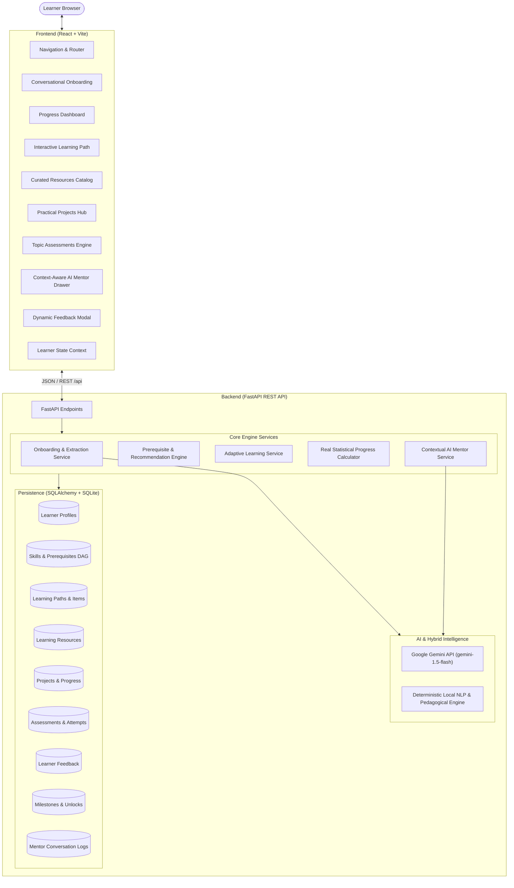

# Architecture Overview: LearnPath

## 1. System Architecture

**LearnPath** is architected as a modular, decoupled full-stack application with clean separation between user interface, business logic, recommendation algorithms, persistence, and AI orchestration.

## 2. Key Components

### 2.1 Frontend Architecture
- **Framework**: React 19 with Vite 8.
- **Styling**: Tailored, accessible Vanilla CSS design system based on Inter typography, consistent spacing tokens, cards, and smooth micro-interactions.
- **State Management**: Centralized `LearnerContext` managing active learner profile, dashboard statistics, toast alerts, global AI mentor drawer, and feedback modal.
- **Zero Mock Policy**: Every interactive control (status toggles, quiz submissions, profile updates, feedback forms, mentor queries) triggers authentic HTTP requests that mutate SQLite.

### 2.2 Backend Architecture
- **Framework**: Python 3.13 + FastAPI.
- **Data Persistence**: SQLAlchemy ORM with SQLite, ensuring zero complex database setup while providing ACID transactions and relational constraints.
- **Startup Seeding**: Automatically initializes tables and populates a rich 40-skill knowledge graph, realistic learning resources, projects, assessments, and milestones on first launch.

### 2.3 AI & Heuristic Layer
- **Primary LLM**: Google Gemini API (`gemini-1.5-flash`).
- **Resilient Local Fallback**: When `GEMINI_API_KEY` is not present in `.env` or during network interruptions, the application activates its deterministic local NLP and pedagogical advice engine. The app is **100% functional offline and without an API key**.
