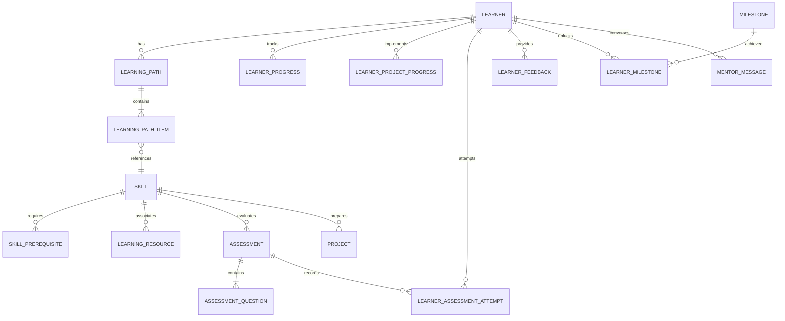

# Data Model & Persistence Schema: LearnPath

LearnPath uses **SQLite** managed via **SQLAlchemy ORM** for persistent local storage.

## 1. Entity-Relationship Diagram

---

## 2. Table Specifications

### `learners`
Stores persistent learner identity, career ambitions, and inferred calibration parameters.
| Column | Type | Description |
|---|---|---|
| `id` | INTEGER (PK) | Unique learner identifier |
| `name` | VARCHAR(100) | Learner display name |
| `target_goal` | VARCHAR(255) | Stated learning/career goal |
| `direction` | VARCHAR(100) | Domain (Cloud / DevOps, Full-Stack, AI/ML, Data Eng) |
| `current_knowledge` | TEXT (JSON) | Array of declared prior known skills |
| `current_level` | VARCHAR(50) | Beginner, Early Intermediate, Intermediate, Advanced |
| `available_time` | VARCHAR(100) | Study time budget (e.g. "1-2 hours daily") |
| `target_timeline` | VARCHAR(100) | Target completion timeline (e.g. "3 months") |
| `learning_preference` | VARCHAR(100) | Practical/Project-based, Visual, Theory-first |
| `weak_areas` | TEXT (JSON) | Array of detected weak topics from quizzes |
| `created_at` | DATETIME | Account creation timestamp |

### `skills` & `skill_prerequisites`
Represents the knowledge ontology and directed prerequisite dependencies.
| Table | Column | Type | Description |
|---|---|---|---|
| `skills` | `id` | INTEGER (PK) | Skill ID |
| `skills` | `name` | VARCHAR(100) | e.g. "Linux Fundamentals", "Docker" |
| `skills` | `domain` | VARCHAR(100) | High-level technical domain |
| `skills` | `difficulty_level` | VARCHAR(50) | Beginner, Intermediate, Advanced |
| `skill_prerequisites` | `skill_id` | INTEGER (FK) | Target skill |
| `skill_prerequisites` | `prerequisite_skill_id` | INTEGER (FK) | Required parent skill |

### `learning_paths` & `learning_path_items`
Structured, sequential roadmap generated for each learner.
| Table | Column | Type | Description |
|---|---|---|---|
| `learning_paths` | `id` | INTEGER (PK) | Learning path ID |
| `learning_paths` | `learner_id` | INTEGER (FK) | Owner learner |
| `learning_paths` | `is_active` | BOOLEAN | Active roadmap flag |
| `learning_path_items` | `id` | INTEGER (PK) | Stage ID |
| `learning_path_items` | `path_id` | INTEGER (FK) | Associated learning path |
| `learning_path_items` | `stage_order` | INTEGER | Sequence order (1, 2, 3...) |
| `learning_path_items` | `title` | VARCHAR(255) | Stage title |
| `learning_path_items` | `why_recommended` | TEXT | Algorithmic & prerequisite justification |
| `learning_path_items` | `status` | VARCHAR(50) | completed, in_progress, available, locked, skipped |
| `learning_path_items` | `is_adaptive_remedial` | BOOLEAN | True if inserted adaptively from feedback/quiz |

### `learner_feedback`
Captures learner sentiment, difficulty ratings, and adaptation actions.
| Column | Type | Description |
|---|---|---|
| `id` | INTEGER (PK) | Feedback ID |
| `learner_id` | INTEGER (FK) | Submitting learner |
| `item_title` | VARCHAR(255) | Evaluated learning topic or resource |
| `rating` | VARCHAR(50) | easy, good, difficult, very_difficult |
| `comment` | TEXT | Free-text learner reflection |
| `action_applied` | VARCHAR(255) | Dynamic adaptation performed by engine |

### `assessments`, `assessment_questions`, `learner_assessment_attempts`
Interactive quiz question bank and attempt histories with weak-area logging.
