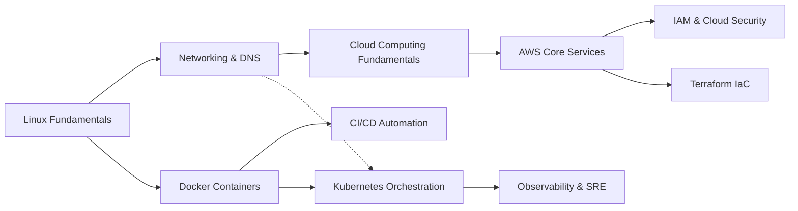

# Recommendation & Adaptive Engine Logic

## 1. Core Principles

LearnPath separates **recommendation logic** from **natural language generation**:
- **Application Logic**: Evaluates prerequisite graphs, goal alignment, skill gaps, and learner level deterministically.
- **AI Layer**: Interprets conversational onboarding, answers contextual learner questions, and explains recommendation decisions.

This prevents hallucinations and ensures the generated roadmap has logically sound sequence dependencies.

---

## 2. Prerequisite Dependency Graph (DAG)

Skills are structured as a Directed Acyclic Graph:

### Topological Sorting
1. When generating a path for a learner direction (e.g. `Cloud / DevOps`), the engine extracts all relevant skills and their incoming prerequisite edges.
2. A topological traversal builds the base sequence where every parent prerequisite precedes its dependent child.

---

## 3. Prerequisite Awareness & Skipping

When a learner declares known prior knowledge during onboarding (e.g. "I already know Linux and Python"):
1. The engine checks the learner's `current_knowledge` against the domain skills using fuzzy normalization.
2. If a prerequisite skill is already known:
   - It is marked as **`completed`** / **`credited`** immediately.
   - It is not presented as an upcoming barrier or beginner repetition.
   - Downstream topics that rely on it are unlocked.
3. The first uncompleted topic whose prerequisites are satisfied becomes the active **`in_progress`** module.
4. Downstream topics with unsatisfied prerequisites remain **`locked`**.

---

## 4. Scoring Algorithm

For ranking and prioritizing learning stages:

$$\text{Score} = (\text{Relevance} \times 40) + (\text{PrereqStatus} \times 30) + (\text{DifficultyFit} \times 20) - \text{FeedbackPenalty}$$

- **Goal Relevance ($40\text{ pts}$)**: Proximity to learner's stated career objective.
- **Prerequisite Status ($30\text{ pts}$)**: $30\text{ pts}$ if all prerequisites are fulfilled; $5\text{ pts}$ if blocked.
- **Difficulty Alignment ($20\text{ pts}$)**: Minimizes distance between learner's current level ($1=\text{Beginner}, 2=\text{Intermediate}, 3=\text{Advanced}$) and skill difficulty.
- **Feedback Penalty**: Applied if the learner repeatedly rated similar topics as unhelpful or redundant.

---

## 5. Contextual Rationale Generation

Every stage produces a tailored **"Why this recommendation?"** explanation:
- If known: *"You indicated prior familiarity with [Topic]. We credited this foundation so you can advance to high-leverage material."*
- If dependent: *"[Topic] was sequenced after [Prerequisites] to ensure foundational mastery before tackling production deployments."*
- If starting: *"[Topic] serves as the primary stepping stone for [Domain], unlocking the toolkit needed for downstream projects."*

---

## 6. Feedback & Adaptive Learning Engine

The roadmap is dynamic and continuously calibrates based on two feedback vectors:

### A. Learner Feedback (Difficulty / Pace)
- **Rating: "Difficult" or "Very Difficult" / Comments like "need more practice"**:
  - The system shifts subsequent stages forward by $+1$.
  - Injects a new **Adaptive Remedial Module**: `[Topic]: Guided Practice Lab & Refresher`.
  - Explains the dynamic insertion to the learner.
- **Comments like "I already know this" or "Skip"**:
  - Automatically marks the stage as completed/fast-tracked.
  - Recalculates downstream dependencies and unlocks the next stage.

### B. Assessment Quizzes
- **Score $\ge 70\%$**:
  - Confirms mastery.
  - Marks stage as completed, unlocking downstream locked stages.
  - Checks milestone criteria and triggers badge unlock if eligible.
- **Score $< 70\%$**:
  - Extracts incorrect question topics and updates the learner's `weak_areas`.
  - Injects a targeted **Refresher Stage** into the active roadmap.
