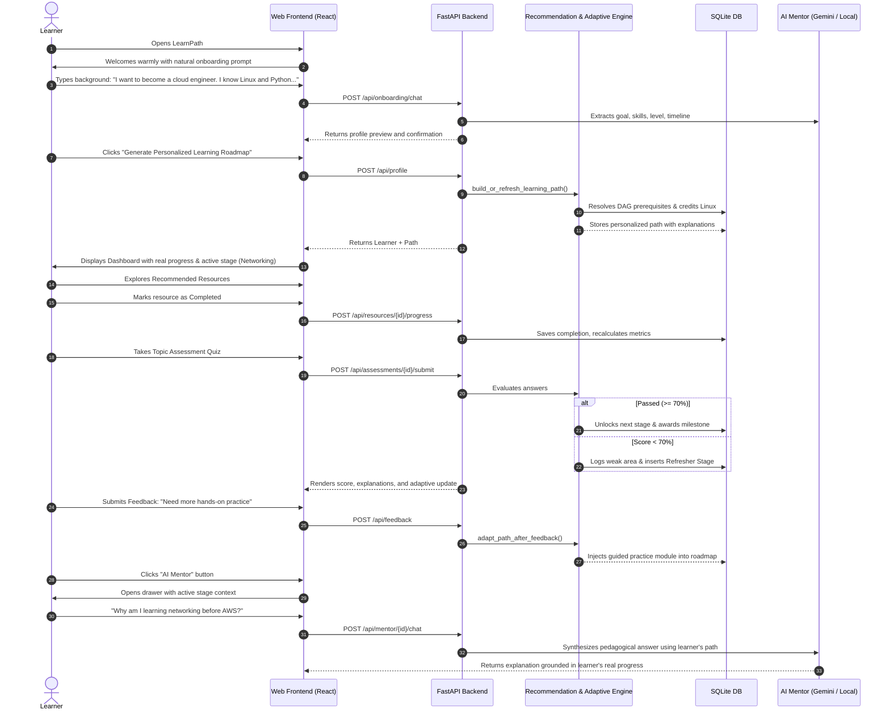

# User Workflow & Journey: LearnPath

## Step-by-Step Experience

1. **Conversational Onboarding**:
   - The learner enters goals and existing knowledge naturally.
   - The system avoids redundant questions, extracting level, timeline, and preferences automatically.
2. **Review & Calibration**:
   - The live profile preview displays what the system inferred.
   - The learner can correct or expand their prior skills before generating the roadmap.
3. **Personalized Roadmap Exploration**:
   - The generated roadmap credits prior knowledge (e.g. Linux) and unlocks eligible modules.
   - Every stage features an explicit "Why this recommendation?" box.
4. **Active Learning & Progress**:
   - The learner marks resources as in progress or completed.
   - The dashboard updates mathematically from actual database records.
5. **Interactive Quizzes**:
   - Quizzes validate comprehension and provide immediate answer explanations.
   - Scores below 70% automatically adapt the roadmap by scheduling a refresher module.
6. **Adaptive Feedback Loop**:
   - Quick ratings ("Easy", "Difficult") and free-text notes dynamically adapt subsequent recommendations.
7. **Always-Available AI Mentor**:
   - The mentor drawer maintains awareness of the learner's current stage, completed topics, weak areas, and time constraints.
